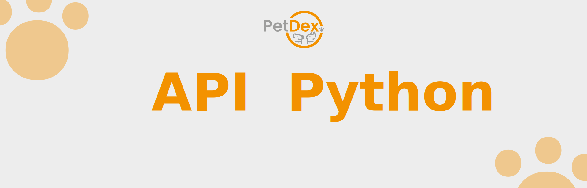

<p align="center">
  
</p>

# 🧮 API em Python — O Cérebro Analítico da PetDex

Bem-vindo à API de Análise de Dados da PetDex! Desenvolvida com **Python** e **FastAPI**, esta API é o coração analítico do nosso ecossistema. Ela é responsável por **transformar os dados brutos coletados pela coleira em insights acionáveis** e executar o **modelo de Inteligência Artificial** que identifica a espécie do animal, capacitando os donos a cuidarem melhor da saúde de seus pets.

---

## ⚙️ Tecnologias Utilizadas

* **Python 3.11**
* **FastAPI** (Framework web moderno e assíncrono)
* **Pandas** (Análise e manipulação de dados)
* **NumPy** (Cálculos numéricos e estatísticos)
* **SciPy** (Cálculos científicos, como a distribuição normal)
* **Scikit-learn** (Modelos de Machine Learning)
* **PyPMML** (Carregamento e execução de modelos PMML)
* **httpx** (Cliente HTTP assíncrono para comunicação com a API Java)
* **Uvicorn** (Servidor ASGI)
* **Azure** (Plataforma de hospedagem da API)

---

## 🧠 Objetivo da API

Esta API **não coleta dados diretamente da coleira**. Seu papel estratégico é **consumir os dados já armazenados na API principal (Java)** e aplicar uma camada de inteligência sobre eles. Ela executa desde cálculos estatísticos avançados até a **classificação de espécies com Inteligência Artificial**, fornecendo as análises que tornam o aplicativo PetDex uma ferramenta poderosa para o monitoramento da saúde animal.

---

## 🤖 Inteligência Artificial: Modelo CART de Classificação de Espécies

A API Python é responsável por carregar e executar o **modelo de classificação de espécies** da PetDex, que identifica se um animal é um cão ou gato com base em características físicas.

### **O Modelo Escolhido: CART (Árvore de Decisão)**

Após um rigoroso processo de desenvolvimento e validação, o modelo **CART (Classification and Regression Trees)** foi selecionado como o "cérebro" oficial da PetDex para classificação de espécies.

### **Processo de Seleção e Desenvolvimento**

O desenvolvimento do modelo de IA seguiu uma metodologia científica rigorosa, documentada no relatório **"Analise IA PetDex Oficial.pdf"** (disponível na pasta `Aprendizagem de Maquina`):

**1. Desafio Inicial:**
- Decidir entre um modelo **generalista** (8 espécies de animais) ou **especialista** (apenas cães e gatos)
- Análise de viabilidade e aplicabilidade ao contexto do projeto

**2. Treinamento Extensivo:**
- Foram treinados **12 modelos classificadores diferentes**, incluindo:
  - **SVM** (Support Vector Machine)
  - **Logistic Regression**
  - **Árvores de Decisão (CART)**
  - **Random Forest**
  - **Naive Bayes**
  - E outros algoritmos do Scikit-learn

**3. Validação Rigorosa:**
- Análise com **Cross-Validation** (validação cruzada) para avaliar a performance de cada modelo
- Gráficos **Boxplot** para comparar a distribuição de acurácia entre os modelos
- Teste final com **20 casos reais de cães e gatos** para validação prática

**4. Resultado Final:**
- O modelo **CART treinado APENAS com cães e gatos** atingiu **100% de acerto** no teste final
- Demonstrou melhor equilíbrio entre acurácia, interpretabilidade e performance

### **Por que o CART?**

O modelo CART foi escolhido por apresentar:

- ✅ **Alta Acurácia**: 100% de acerto nos testes finais
- ✅ **Interpretabilidade**: Árvores de decisão são fáceis de entender e explicar
- ✅ **Performance**: Rápido para treinamento e predição
- ✅ **Robustez**: Funciona bem com dados categóricos e numéricos
- ✅ **Especialização**: Focado em cães e gatos, os principais pets domésticos

### **Formato PMML: Portabilidade Universal**

Todos os modelos foram exportados para o formato **PMML (Predictive Model Markup Language)**, um padrão universal que permite:

- ✅ **Compatibilidade** com múltiplas plataformas e linguagens de programação
- ✅ **Independência** do framework de treinamento (Scikit-learn)
- ✅ **Fácil integração** com a API Python via biblioteca PyPMML
- ✅ **Portabilidade** para outros sistemas futuros sem necessidade de retreinamento

O arquivo `modelo_CART.pmml` está localizado na raiz do projeto da API Python e é carregado automaticamente na inicialização da aplicação.

### **Integração com o Aplicativo**

<p align="center">
  
</p>
<p align="center">
  <em><b>Tela Checkup Inteligente:</b> O tutor responde sintomas observados, e a IA da PetDex sugere possíveis condições com base nos dados coletados, fornecendo orientações preventivas.</em>
</p>

O aplicativo Flutter consome os endpoints da API Python que utilizam o modelo CART para:

- 🔍 **Identificar a espécie** do animal durante o cadastro
- 🩺 **Realizar checkups inteligentes** baseados em sintomas e dados da coleira
- 📊 **Fornecer análises personalizadas** de acordo com a espécie identificada

### **Documentação Completa**

Para mais detalhes sobre o processo de desenvolvimento, treinamento e validação do modelo de IA, consulte:

📄 **[Analise IA PetDex Oficial.pdf](../Aprendizagem%20de%20Maquina/Analise%20IA%20PetDex%20Oficial.pdf)**

Este documento contém:
- Análise completa dos dados
- Metodologia de treino da IA
- Comparação entre todos os modelos testados
- Resultados e métricas de performance
- Conclusões e justificativas da escolha do CART

---

## 🔬 Conectando a Ciência de Dados à Saúde do Seu Pet

O verdadeiro poder desta API está em como suas funcionalidades se traduzem em recursos visuais e práticos para o usuário. Cada cálculo tem um propósito: dar ao dono do pet a tranquilidade e as informações necessárias para tomar decisões importantes.

### **Dashboard de Saúde: Análises Estatísticas Completas**

A API fornece análises estatísticas detalhadas dos batimentos cardíacos do pet, incluindo média, moda, mediana e desvio padrão. Esses dados são apresentados de forma visual e intuitiva no aplicativo.

<p align="center">
  
</p>
<p align="center">
  <em><b>Tela de Saúde:</b> Exibe a média de batimentos diários, gráficos por data e análises estatísticas completas referentes ao último batimento registrado.</em>
</p>

### **Análise de Probabilidade: Cuidado Proativo e Inteligente**

Uma das ferramentas mais importantes da API é a **análise de probabilidade do último batimento cardíaco coletado**. Utilizando a distribuição normal dos dados históricos do pet, a API calcula se o batimento atual está dentro do esperado ou se é um valor estatisticamente atípico.

**Como funciona:**

- 📊 A API analisa o **último batimento cardíaco** registrado pela coleira
- 🧮 Compara com o **histórico completo** de batimentos do animal
- 📈 Calcula a **probabilidade** desse valor ocorrer usando distribuição normal
- ⚠️ Informa ao tutor se o batimento está **dentro do esperado** ou se é **atípico**

Ao identificar um batimento com baixa probabilidade de ocorrência, o tutor é alertado, o que pode **antecipar uma visita ao veterinário e, em casos extremos, salvar a vida do animal**.

<p align="center">
  
</p>
<p align="center">
  <em><b>Tela Inicial:</b> Mostra a última localização e o batimento cardíaco mais recente do pet, além de um gráfico com as médias das últimas horas registradas.</em>
</p>

---

## 📡 Endpoints da API

A API está hospedada em um servidor **Azure** (Ubuntu, Standard B1ms) e pode ser acessada através do link:

🔗 **API Base:** [http://172.206.27.122:8083](http://172.206.27.122:8083)

📘 **Documentação Interativa (Swagger):** [http://172.206.27.122:8083/docs](http://172.206.27.122:8083/docs)

### 🔐 Autenticação JWT

Todos os endpoints (exceto `/health`) requerem autenticação via **JWT (JSON Web Tokens)**.

**Fluxo de Autenticação:**

1. O aplicativo mobile faz login na **API Java** (endpoint `POST /auth/login`)
2. A API Java retorna um **token JWT**
3. O aplicativo envia esse token no header `Authorization: Bearer <token>` para a **API Python**
4. A API Python valida o token usando a mesma chave secreta (`JWT_SECRET`) configurada na API Java

### **🔑 Credenciais de Teste**

Para testar a API, utilize as seguintes credenciais na API Java:

```json
{
  "email": "henriquealmeidaflorentino@gmail.com",
  "senha": "senha123"
}
```

### **📋 Rotas Disponíveis**

Cada endpoint abaixo tem um propósito claro, alimentando uma parte específica da interface do usuário no aplicativo mobile:

| Rota | Método | Descrição | Autenticação |
|:-----|:-------|:----------|:-------------|
| `/health` | GET | Verifica se a API está online e funcionando | ❌ Não requer |
| `/batimentos` | GET | Retorna todos os batimentos cardíacos coletados do animal | ✅ Requer JWT |
| `/batimentos/estatisticas` | GET | Fornece estatísticas completas (média, moda, mediana, desvio padrão, probabilidade do último batimento) | ✅ Requer JWT |
| `/batimentos/media-por-data` | GET | Calcula a média de batimentos em um intervalo de datas específico | ✅ Requer JWT |
| `/batimentos/media-ultimos-5-dias` | GET | Retorna a média diária dos últimos 5 dias (alimenta o gráfico da tela de saúde) | ✅ Requer JWT |
| `/batimentos/media-ultimas-5-horas-registradas` | GET | Retorna a média das últimas 5 horas de coleta (alimenta o gráfico da tela inicial) | ✅ Requer JWT |

### **🎯 Principais Funcionalidades por Endpoint**

**`/batimentos/estatisticas`** - Dashboard de Saúde

Este é o endpoint mais completo da API, fornecendo:

- 📊 **Média** de batimentos cardíacos
- 📈 **Moda** (valor mais frequente)
- 📉 **Mediana** (valor central)
- 📐 **Desvio Padrão** (variabilidade dos dados)
- ⚠️ **Probabilidade do último batimento** (indica se está dentro do esperado)

Alimenta diretamente a tela de saúde do aplicativo:

<p align="center">
  
</p>

**`/batimentos/media-ultimos-5-dias`** - Gráfico de Tendências

Retorna a média diária dos últimos 5 dias, permitindo visualizar tendências de saúde ao longo do tempo.

**`/batimentos/media-ultimas-5-horas-registradas`** - Monitoramento em Tempo Real

Retorna a média das últimas 5 horas de coleta, exibida na tela inicial para acompanhamento rápido:

<p align="center">
  
</p>

---

## 🔗 Comunicação entre APIs

A **API Python se conecta diretamente à API Java** usando o cliente HTTP assíncrono `httpx`. Ela faz requisições paginadas para obter todos os dados de **batimentos cardíacos** (`GET /batimentos/animal/{id}`) armazenados no banco de dados MongoDB.

**Fluxo de Dados:**

1. 📡 **Coleira IoT** → Envia dados em tempo real via WebSocket
2. ☕ **API Java** → Recebe e armazena os dados no MongoDB
3. 🐍 **API Python** → Consulta os dados armazenados e aplica análises estatísticas e IA
4. 📱 **Aplicativo Mobile** → Exibe os insights de forma visual e intuitiva

Esses dados são transformados em `DataFrames` do Pandas, onde são limpos, processados, agrupados e analisados para gerar as estatísticas e insights apresentados ao usuário.

---

## 🔐 Configuração de Autenticação JWT

A API Python implementa autenticação baseada em **JWT (JSON Web Tokens)** e se comunica com a API Java para validar tokens e obter dados.

### **Configuração do JWT_SECRET**

⚠️ **IMPORTANTE:** A chave secreta JWT (`JWT_SECRET`) é essencial para validar os tokens de autenticação.

**Como configurar:**

1. Crie um arquivo `.env` na raiz do projeto (se ainda não existir)
2. Adicione a variável `JWT_SECRET` com a **mesma chave** configurada na API Java:

```env
JWT_SECRET=sua_chave_secreta_aqui_deve_ser_longa_e_complexa
```

**⚙️ Requisitos Importantes:**

- A chave deve ser **idêntica** à configurada na API Java para garantir compatibilidade de autenticação
- Use uma chave forte e complexa (recomendado: mínimo 32 caracteres)
- **NUNCA** compartilhe ou versione o arquivo `.env` com a chave real
- Para referência, consulte o arquivo `.env.example` no projeto

**Por que isso é necessário?**

A API Python recebe tokens JWT do aplicativo mobile e precisa validá-los. Como os tokens são gerados pela API Java, ambas as APIs devem compartilhar a mesma chave secreta (`JWT_SECRET`) para que a validação funcione corretamente.

### **Configuração da API_URL**

A API Python precisa se comunicar com a API Java para obter dados de batimentos cardíacos e movimentos.

**Como configurar:**

Adicione a variável `API_URL` no arquivo `.env` com o endpoint da API Java:

```env
# Para desenvolvimento local
API_URL=http://localhost:8080

# Para produção (servidor Azure)
API_URL=http://172.206.27.122:8080
```

**O que é a API_URL?**

- É o endereço base da API Java
- A API Python usa essa URL para fazer requisições HTTP para endpoints como:
  - `GET /batimentos/animal/{id}` - Obter batimentos cardíacos
  - `GET /movimentos/animal/{id}` - Obter dados de movimento
- Certifique-se de que a API Java está acessível nesse endereço

---

## 📁 Como Executar Localmente

### **📋 Pré-requisitos**

Antes de executar a API Python, certifique-se de ter instalado:

* **Python 3.11** ou superior
  - [Download do Python](https://www.python.org/downloads/)
  - Verifique a instalação: `python --version` ou `python3 --version`
* **pip** (gerenciador de pacotes Python, geralmente incluído com Python)
  - Verifique a instalação: `pip --version`
* **Git** para clonar o repositório
* **API Java** rodando (local ou remota) para comunicação entre APIs

### **🚀 Passos para Execução**

**1. Clone o repositório:**

```bash
git clone https://github.com/FatecFranca/DSM-P4-G07-2025-1.git
cd DSM-P4-G07-2025-1/api-python
```

**2. Crie e ative um ambiente virtual:**

```bash
# Criar ambiente virtual
python -m venv .venv

# Ativar no Linux/Mac
source .venv/bin/activate

# Ativar no Windows (PowerShell)
.venv\Scripts\Activate.ps1

# Ativar no Windows (CMD)
.venv\Scripts\activate.bat
```

**3. Configure as variáveis de ambiente:**

Crie um arquivo `.env` na raiz do projeto (copie do `.env.example`):

```bash
cp .env.example .env
```

Edite o arquivo `.env` e configure as seguintes variáveis:

```env
# Chave secreta JWT (deve ser idêntica à da API Java)
JWT_SECRET=sua_chave_secreta_aqui_deve_ser_longa_e_complexa

# URL da API Java
API_URL=http://localhost:8080

# Porta da aplicação (padrão: 8000)
PORT=8000

# ID do animal para análise (obtido da API Java)
ANIMAL_ID=seu_animal_id_aqui
```

**4. Instale as dependências:**

```bash
pip install -r requirements.txt
```

**5. Execute a aplicação:**

```bash
# Modo desenvolvimento (com reload automático)
uvicorn app.main:app --reload --host 0.0.0.0 --port 8000

# Ou usando o script run.py
python run.py
```

**6. Acesse a aplicação:**

- **API Base:** `http://localhost:8000`
- **Documentação Swagger:** `http://localhost:8000/docs`
- **Documentação ReDoc:** `http://localhost:8000/redoc`
- **Health Check:** `http://localhost:8000/health`

### **🔧 Comandos Úteis**

```bash
# Atualizar dependências
pip install --upgrade -r requirements.txt

# Congelar dependências atuais
pip freeze > requirements.txt

# Executar em modo produção (sem reload)
uvicorn app.main:app --host 0.0.0.0 --port 8000

# Executar com múltiplos workers (produção)
uvicorn app.main:app --host 0.0.0.0 --port 8000 --workers 4
```

### **🐳 Executar com Docker (Opcional)**

Se preferir usar Docker:

```bash
# Construir a imagem Docker
docker build -t petdex-api-python .

# Executar o container
docker run -p 8000:8000 --env-file .env petdex-api-python
```

### **⚙️ Configurações Adicionais**

**Porta da Aplicação:**

- A API roda por padrão na porta **8000**
- Para alterar, modifique a variável `PORT` no arquivo `.env` ou use o parâmetro `--port` no comando uvicorn

**Dependências Principais:**

- **FastAPI**: Framework web assíncrono
- **Uvicorn**: Servidor ASGI
- **Pandas**: Análise de dados
- **NumPy**: Cálculos numéricos
- **Scikit-learn**: Modelos de machine learning
- **PyPMML**: Execução de modelos PMML
- **httpx**: Cliente HTTP assíncrono

---

## 🚀 Infraestrutura de Hospedagem

A API está hospedada em um servidor **Microsoft Azure** com as seguintes especificações:

- **Sistema Operacional:** Ubuntu
- **Tipo de Máquina:** Standard B1ms
- **IP Público:** 172.206.27.122
- **Porta:** 8083

Esta infraestrutura garante alta disponibilidade e performance para o processamento analítico e execução do modelo de IA em tempo real.

---

## ✅ Status

🟢 **Em produção** — a API está em funcionamento e integrada com o ecossistema PetDex.